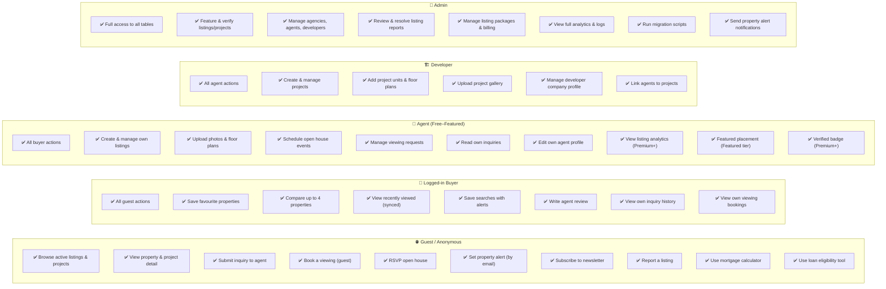
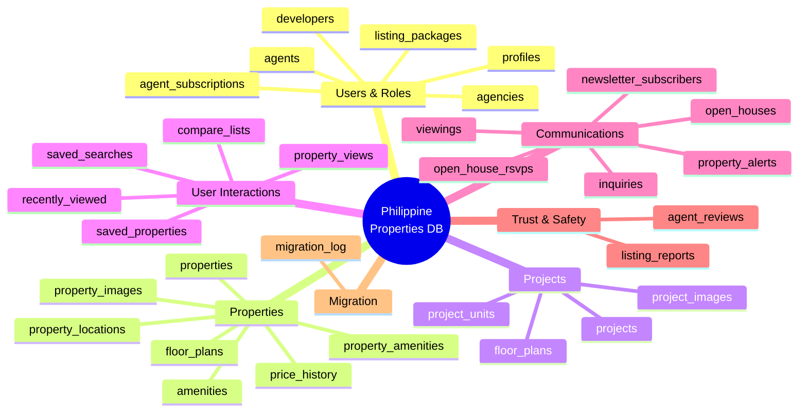
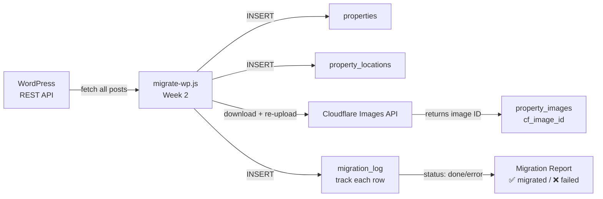
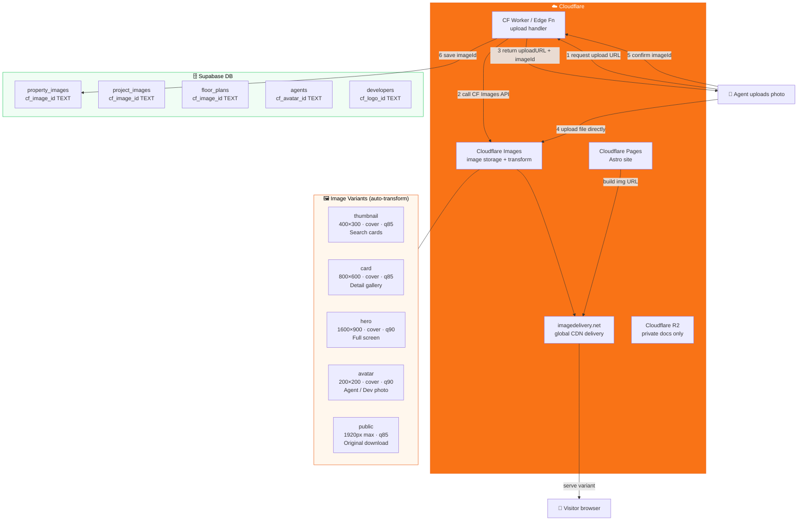

# Philippine Properties — Database Diagram (Lamudi-Complete)

> Open in VS Code with **Mermaid Preview** extension,
> or paste any block into **https://mermaid.live** → click Share for a link.

---

## 1. System Data Flow

```mermaid
flowchart TD
    subgraph USERS["👥 User Types"]
        A1["🧑 Guest / Buyer"]
        A2["🏢 Agent"]
        A3["🏗️ Developer"]
        A4["👑 Admin"]
    end

    subgraph SITE["🌐 Philippine Properties Website"]
        B1["Search & Browse"]
        B2["Property Detail"]
        B3["Project Page"]
        B4["Agent / Developer Profile"]
        B5["List a Property"]
        B6["Contact / Inquiry"]
        B7["Save / Compare"]
        B8["Schedule Viewing"]
        B9["Open House RSVP"]
        B10["Set Alert / Saved Search"]
        B11["Report a Listing"]
        B12["Admin Dashboard"]
    end

    subgraph DB["🗄️ Supabase Database"]
        direction TB
        C1["properties"]
        C2["projects"]
        C3["agents + developers"]
        C4["inquiries"]
        C5["viewings + open_houses"]
        C6["saved_properties + recently_viewed"]
        C7["property_alerts + saved_searches"]
        C8["listing_reports"]
        C9["price_history"]
        C10["property_views (analytics)"]
        C11["agent_subscriptions + listing_packages"]
    end

    subgraph STORAGE["☁️ Cloudflare Images + R2"]
        S1["CF Images\nproperty photos"]
        S2["CF Images\nproject photos"]
        S3["CF Images\nfloor plans"]
        S4["CF Images\nagent / dev avatars"]
        S5["CF R2\ndocuments (private)"]
        S6["CDN delivery\nimagedelivery.net"]
    end

    subgraph EDGE["⚡ Edge Functions"]
        E1["send-inquiry (email agent)"]
        E2["notify-alert (email buyer)"]
        E3["confirm-viewing (email)"]
        E4["report-listing (notify admin)"]
    end

    A1 --> B1 & B2 & B6 & B7 & B8 & B9 & B10 & B11
    A2 --> B5 & B4 & B12
    A3 --> B3 & B4 & B12
    A4 --> B12

    B1 -->|search_properties()| C1
    B1 -->|query| C2
    B2 -->|read + log| C1 & C9 & C10
    B3 -->|read| C2
    B4 -->|read| C3
    B5 -->|write| C1
    B5 -->|upload via Edge Fn| S1
    B6 -->|write| C4 --> E1
    B7 -->|write| C6
    B8 -->|write| C5 --> E3
    B9 -->|write| C5
    B10 -->|write| C7 --> E2
    B11 -->|write| C8 --> E4
    B12 -->|full access| C1 & C2 & C3 & C4 & C5 & C8 & C11

    style USERS fill:#fff7ed,stroke:#ea580c,color:#000
    style SITE fill:#eff6ff,stroke:#3b82f6,color:#000
    style DB fill:#f0fdf4,stroke:#22c55e,color:#000
    style STORAGE fill:#fdf4ff,stroke:#a855f7,color:#000
    style EDGE fill:#fefce8,stroke:#eab308,color:#000
```

---

## 2. Full Entity Relationship Diagram (ERD)

```mermaid
erDiagram

    PROFILES {
        uuid id PK
        text full_name
        text phone
        text avatar_url
        enum role "buyer|seller|agent|developer|admin"
        bool is_verified
    }

    AGENCIES {
        uuid id PK
        text name
        text slug
        text logo_url
        bool is_verified
        bool is_active
    }

    AGENTS {
        uuid id PK-FK
        uuid agency_id FK
        text license_number
        text[] specializations
        text[] service_areas
        text whatsapp_number
        numeric rating_avg
        int rating_count
        int total_sold
    }

    DEVELOPERS {
        uuid id PK-FK
        text company_name
        text slug
        text logo_url
        text website
        bool is_verified
        int total_projects
    }

    LISTING_PACKAGES {
        uuid id PK
        enum tier "Free|Basic|Premium|Featured"
        numeric price_php
        int duration_days
        int max_listings
        int max_photos
        bool has_featured
        bool has_analytics
        bool has_priority
    }

    AGENT_SUBSCRIPTIONS {
        uuid id PK
        uuid agent_id FK
        uuid package_id FK
        timestamptz starts_at
        timestamptz expires_at
        bool is_active
        text payment_ref
    }

    PROJECTS {
        uuid id PK
        text slug
        text name
        uuid developer_id FK
        uuid agent_id FK
        enum property_type
        enum status "Pre-selling|Under Construction|RFO|Sold Out"
        numeric min_price
        numeric max_price
        int total_units
        int available_units
        date turnover_date
        text city
        text province
        numeric latitude
        numeric longitude
        text virtual_tour_url
        text video_url
        bool is_featured
        int view_count
    }

    PROJECT_IMAGES {
        uuid id PK
        uuid project_id FK
        text url
        bool is_primary
        int sort_order
    }

    PROJECT_UNITS {
        uuid id PK
        uuid project_id FK
        uuid property_id FK
        text unit_type "Studio|1BR|2BR|3BR|Penthouse"
        numeric floor_area
        numeric price
        int bedrooms
        int bathrooms
        enum status "Available|Reserved|Sold"
    }

    PROPERTIES {
        uuid id PK
        text slug
        text title
        enum listing_type "For Sale|For Rent|Pre-selling|Lease to Own"
        enum property_type
        enum status "active|sold|rented|pending|draft"
        numeric price
        numeric price_per_sqm
        int bedrooms
        int bathrooms
        numeric floor_area
        numeric lot_area
        int parking_spaces
        enum furnished
        uuid agent_id FK
        uuid agency_id FK
        uuid owner_id FK
        uuid developer_id FK
        uuid project_id FK
        bool is_featured
        bool is_verified
        bool accepts_pag_ibig
        text virtual_tour_url
        text video_url
        int view_count
        int inquiry_count
        int save_count
        int wp_post_id
    }

    PROPERTY_LOCATIONS {
        uuid id PK
        uuid property_id FK
        text full_address
        text barangay
        text city
        text province
        text region
        numeric latitude
        numeric longitude
    }

    PROPERTY_IMAGES {
        uuid id PK
        uuid property_id FK
        text url
        bool is_primary
        int sort_order
    }

    FLOOR_PLANS {
        uuid id PK
        uuid property_id FK
        uuid project_id FK
        text unit_type
        text label
        text url
        int sort_order
    }

    AMENITIES {
        uuid id PK
        text name
        text icon
        enum category "building|unit|outdoor|nearby"
    }

    PROPERTY_AMENITIES {
        uuid property_id PK-FK
        uuid amenity_id PK-FK
    }

    PRICE_HISTORY {
        uuid id PK
        uuid property_id FK
        numeric old_price
        numeric new_price
        uuid changed_by FK
        timestamptz recorded_at
    }

    SAVED_PROPERTIES {
        uuid id PK
        uuid user_id FK
        uuid property_id FK
        timestamptz created_at
    }

    RECENTLY_VIEWED {
        uuid id PK
        uuid user_id FK
        uuid property_id FK
        timestamptz viewed_at
    }

    SAVED_SEARCHES {
        uuid id PK
        uuid user_id FK
        text name
        jsonb filters
        bool alert_enabled
        timestamptz last_alerted
    }

    INQUIRIES {
        uuid id PK
        uuid property_id FK
        uuid agent_id FK
        uuid sender_id FK
        text sender_name
        text sender_email
        text message
        enum status "new|read|replied|closed"
    }

    VIEWINGS {
        uuid id PK
        uuid property_id FK
        uuid agent_id FK
        uuid user_id FK
        date preferred_date
        time preferred_time
        enum status "pending|confirmed|cancelled|completed"
    }

    OPEN_HOUSES {
        uuid id PK
        uuid property_id FK
        uuid agent_id FK
        date event_date
        time start_time
        time end_time
        int max_attendees
    }

    OPEN_HOUSE_RSVPS {
        uuid id PK
        uuid open_house_id FK
        uuid user_id FK
        text name
        text email
        text phone
    }

    PROPERTY_ALERTS {
        uuid id PK
        text email
        uuid user_id FK
        enum listing_type
        enum property_type
        text city
        numeric min_price
        numeric max_price
        int min_bedrooms
        bool is_active
    }

    LISTING_REPORTS {
        uuid id PK
        uuid property_id FK
        uuid reporter_id FK
        text reporter_email
        enum reason "spam|incorrect_info|already_sold|duplicate|other"
        text description
        enum status "pending|reviewed|resolved|dismissed"
    }

    AGENT_REVIEWS {
        uuid id PK
        uuid agent_id FK
        uuid reviewer_id FK
        int rating "1-5"
        text comment
    }

    PROPERTY_VIEWS {
        uuid id PK
        uuid property_id FK
        uuid user_id FK
        text ip_hash
        text referrer
        timestamptz viewed_at
    }

    NEWSLETTER_SUBSCRIBERS {
        uuid id PK
        text email
        uuid user_id FK
        bool is_active
    }

    MIGRATION_LOG {
        uuid id PK
        text entity_type
        int wp_id
        uuid supabase_id
        text status
    }

    %% --- Core hierarchy ---
    PROFILES         ||--o|  AGENTS              : "is an"
    PROFILES         ||--o|  DEVELOPERS          : "is a"
    AGENCIES         ||--o{  AGENTS              : "employs"
    AGENTS           ||--o|  AGENT_SUBSCRIPTIONS : "subscribes to"
    LISTING_PACKAGES ||--o{  AGENT_SUBSCRIPTIONS : "covers"

    %% --- Projects ---
    DEVELOPERS       ||--o{  PROJECTS            : "builds"
    AGENTS           ||--o{  PROJECTS            : "sells"
    PROJECTS         ||--o{  PROJECT_IMAGES      : "has photos"
    PROJECTS         ||--o{  PROJECT_UNITS       : "has units"
    PROJECTS         ||--o{  FLOOR_PLANS         : "has floor plans"

    %% --- Properties ---
    AGENTS           ||--o{  PROPERTIES          : "lists"
    AGENCIES         ||--o{  PROPERTIES          : "owns"
    DEVELOPERS       ||--o{  PROPERTIES          : "builds"
    PROJECTS         ||--o{  PROPERTIES          : "contains"
    PROPERTIES       ||--||  PROPERTY_LOCATIONS  : "located at"
    PROPERTIES       ||--o{  PROPERTY_IMAGES     : "has photos"
    PROPERTIES       ||--o{  FLOOR_PLANS         : "has floor plans"
    PROPERTIES       ||--o{  PROPERTY_AMENITIES  : "offers"
    AMENITIES        ||--o{  PROPERTY_AMENITIES  : "tagged in"
    PROPERTIES       ||--o{  PRICE_HISTORY       : "price tracked"

    %% --- User interactions ---
    PROFILES         ||--o{  SAVED_PROPERTIES    : "saves"
    PROPERTIES       ||--o{  SAVED_PROPERTIES    : "saved by"
    PROFILES         ||--o{  RECENTLY_VIEWED     : "viewed"
    PROPERTIES       ||--o{  RECENTLY_VIEWED     : "viewed by"
    PROFILES         ||--o{  SAVED_SEARCHES      : "has"

    %% --- Communications ---
    PROPERTIES       ||--o{  INQUIRIES           : "receives"
    AGENTS           ||--o{  INQUIRIES           : "handles"
    PROFILES         ||--o{  INQUIRIES           : "sends"
    PROPERTIES       ||--o{  VIEWINGS            : "booked for"
    AGENTS           ||--o{  VIEWINGS            : "manages"
    PROPERTIES       ||--o{  OPEN_HOUSES         : "hosts"
    OPEN_HOUSES      ||--o{  OPEN_HOUSE_RSVPS    : "attended by"

    %% --- Alerts & Reports ---
    PROFILES         ||--o{  PROPERTY_ALERTS     : "subscribes"
    PROPERTIES       ||--o{  LISTING_REPORTS     : "reported via"
    AGENTS           ||--o{  AGENT_REVIEWS       : "reviewed in"
    PROPERTIES       ||--o{  PROPERTY_VIEWS      : "tracked by"
    PROFILES         ||--o{  NEWSLETTER_SUBSCRIBERS : "subscribes"
```

---

## 3. Role & Access Summary (Complete)



---

## 4. Complete Table Inventory



---

## 5. Migration Path (WP → Supabase)



---

## 6. Cloudflare Images Architecture



**URL pattern in code:**
```
https://imagedelivery.net/{CF_ACCOUNT_HASH}/{cf_image_id}/thumbnail
https://imagedelivery.net/{CF_ACCOUNT_HASH}/{cf_image_id}/card
https://imagedelivery.net/{CF_ACCOUNT_HASH}/{cf_image_id}/hero
```

**Private docs (contracts, titles) → Cloudflare R2 with signed URLs only.**
