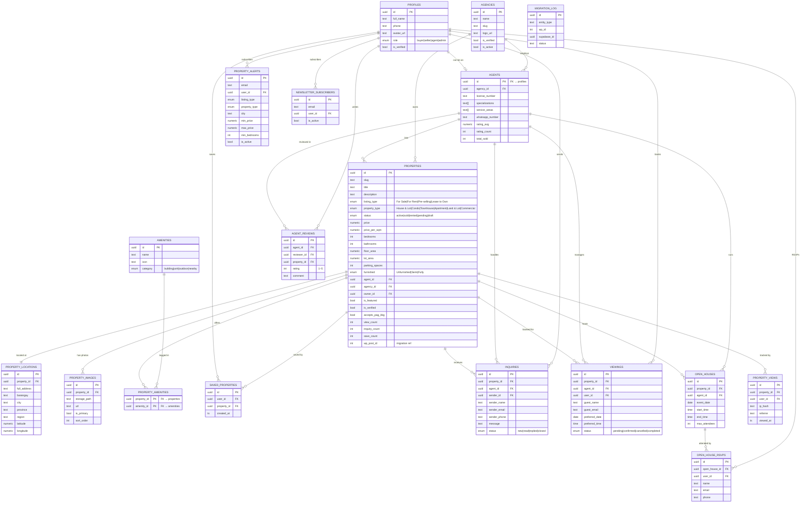
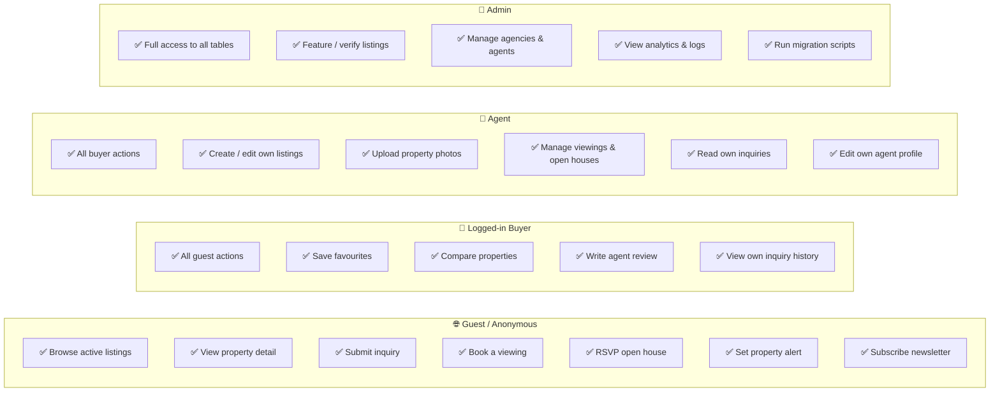
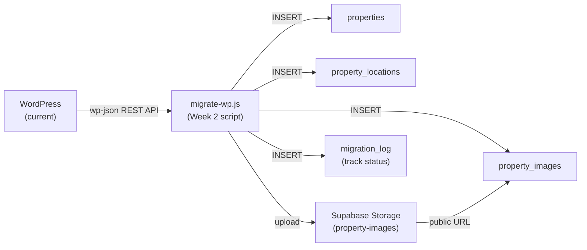

# Philippine Properties — Database Diagram

> Open this file in VS Code with the **Mermaid Preview** extension (`Ctrl+Shift+P` → "Mermaid Preview"),  
> or paste any diagram block into **https://mermaid.live** for a shareable image.

---

## 1. System Data Flow (Level 0 + Level 1)

```mermaid
flowchart TD
    subgraph USERS["👥 User Types"]
        A1["🧑 Buyer / Guest"]
        A2["🏢 Agent / Seller"]
        A3["👑 Admin"]
    end

    subgraph SITE["🌐 Philippine Properties Website"]
        B1["Search & Browse Listings"]
        B2["Property Detail Page"]
        B3["Agent Profile Page"]
        B4["List a Property"]
        B5["Schedule Viewing / Open House"]
        B6["Contact / Inquiry Form"]
        B7["Save to Favourites"]
        B8["Set Property Alert"]
        B9["Admin Dashboard"]
    end

    subgraph DB["🗄️ Supabase Database"]
        C1["properties"]
        C2["property_locations"]
        C3["property_images"]
        C4["property_amenities"]
        C5["agents + profiles"]
        C6["inquiries"]
        C7["viewings"]
        C8["open_houses"]
        C9["saved_properties"]
        C10["property_alerts"]
        C11["property_views"]
        C12["agent_reviews"]
    end

    subgraph STORAGE["🪣 Supabase Storage"]
        S1["property-images bucket"]
        S2["agent-avatars bucket"]
        S3["documents bucket (private)"]
    end

    subgraph EDGE["⚡ Edge Functions"]
        E1["send-inquiry"]
        E2["notify-alert"]
        E3["confirm-viewing"]
    end

    A1 -->|browse| B1
    A1 -->|view| B2
    A1 -->|submit| B6
    A1 -->|save| B7
    A1 -->|subscribe| B8
    A1 -->|book| B5

    A2 -->|create listing| B4
    A2 -->|manage| B9

    A3 -->|full access| B9

    B1 -->|search_properties()| C1
    B2 -->|read| C1
    B2 -->|read| C2
    B2 -->|read| C3
    B2 -->|read| C5
    B2 -->|log visit| C11
    B3 -->|read| C5
    B3 -->|read| C12
    B4 -->|write| C1
    B4 -->|write| C2
    B4 -->|upload| S1
    B5 -->|write| C7
    B5 -->|write| C8
    B6 -->|write| C6
    B6 -->|trigger| E1
    B7 -->|write| C9
    B8 -->|write| C10
    B8 -->|trigger| E2

    E1 -->|email agent| A2
    E2 -->|email subscriber| A1
    E3 -->|email confirmation| A1

    style USERS fill:#fff7ed,stroke:#ea580c,color:#000
    style SITE fill:#eff6ff,stroke:#3b82f6,color:#000
    style DB fill:#f0fdf4,stroke:#22c55e,color:#000
    style STORAGE fill:#fdf4ff,stroke:#a855f7,color:#000
    style EDGE fill:#fefce8,stroke:#eab308,color:#000
```

---

## 2. Entity Relationship Diagram (ERD)



---

## 3. Role & Access Summary



---

## 4. Migration Path (WP → Supabase)


